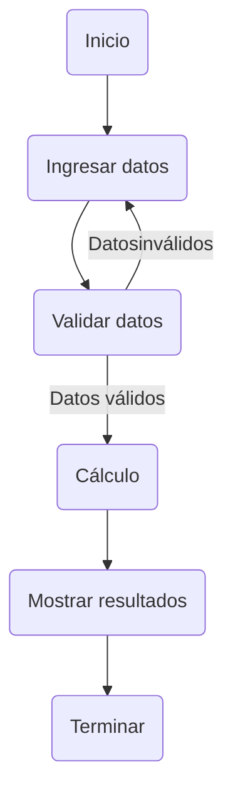

# Taller de Motocicletas - Aplicación para calcular precios

## Descripción
En este proyecto se busca desarrollar una aplicación que permita calcular los precios en conjunto de los repuestos y la mano de obra al momento de realizar el mantenimiento de una moto en un taller de motocicletas. Como información básica de cada cliente se debe registrar su número de documento asociado a la placa de su moto.

## Historias de usuario
### Calcular precio de mantenimiento
Como un cliente del taller de motocicletas, quiero poder ingresar los repuestos que necesita mi moto y ver el precio total del mantenimiento incluyendo la mano de obra, para conocer el costo total del servicio.

**Criterios de aceptación:**
- Se debe poder ingresar una lista de repuestos necesarios para el mantenimiento de la moto.
- Se debe poder calcular el precio total de los repuestos y la mano de obra.
- Se debe mostrar el precio total al usuario.

**Escenario:**
Dado que soy un cliente del taller de motocicletas
Cuando ingreso una lista de repuestos necesarios
Entonces la aplicación me muestra el precio total del mantenimiento incluyendo la mano de obra.

**Casos de uso**

**Diagrama de flujo**

## Pseudocódigo

1. Pedir al usuario el número de documento y placa de la moto a la que se le realizará el mantenimiento.
2. Verificar que los datos ingresados sean válidos y que la moto exista en la base de datos.
3. Si los datos son válidos, mostrar un menú con las opciones de mantenimiento disponibles y pedir al usuario que seleccione una.
4. Si el usuario selecciona una opción de mantenimiento, pedir al usuario que confirme la operación.
5. Si el usuario confirma la operación, calcular el costo total del mantenimiento, incluyendo el costo de los repuestos y la mano de obra.
6. Mostrar el costo total al usuario y preguntar si desea realizar otro mantenimiento.
7. Si el usuario desea realizar otro mantenimiento, volver al paso 3.
8. Si el usuario no desea realizar otro mantenimiento, mostrar un mensaje de despedida y finalizar el programa.

